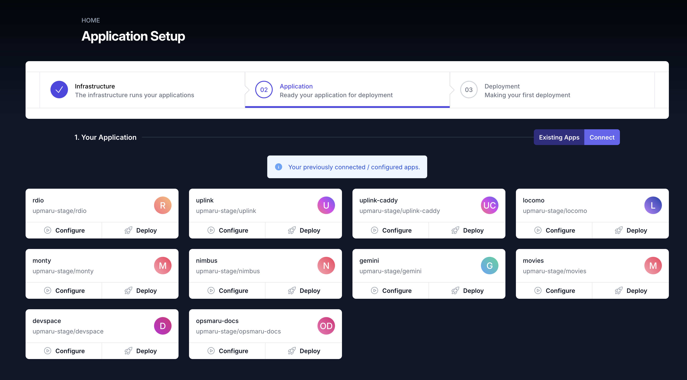
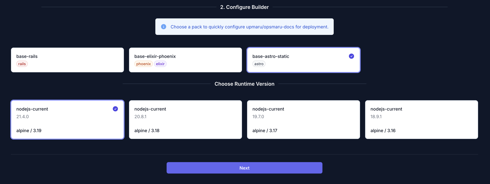

Once you have provisioned your infrastructure by running it using a Terraform runner, the next step is getting your application deployed. This guide will show you how to configure your Phoenix app for deployment.

:::note[Connect your repo]
Make sure you have [connected your repository](/docs/application/connect-repository/) to OpsMaru. You should see your app in the `Existing Apps` tab.
:::

Click on `Configure` on the target app you want to deploy.



## Astro static site

For your Astro app, select the `base-astro-static` pack. This build pack will build your astro site and serve it using the `caddy` web server.



### Caddyfile

The static site config depends on a `Caddyfile`. You can add a `Caddyfile` with the following content. Replace the `app-name` with the name of your application.


```caddy
{
  auto_https off
  admin off
}

:3000 {
  root * /var/lib/app-name/dist
  file_server
}
```

## Configuration Generation

Once you click `Next` you'll see a preview and breakdown of the configuration that will be delivered to your application.

This configuration is meant as a starting point for your application. You can configure this further once it's submitted to your repository as a pull request.

Once you've merged the config and added the `Caddyfile`, your static site should build and deploy.

