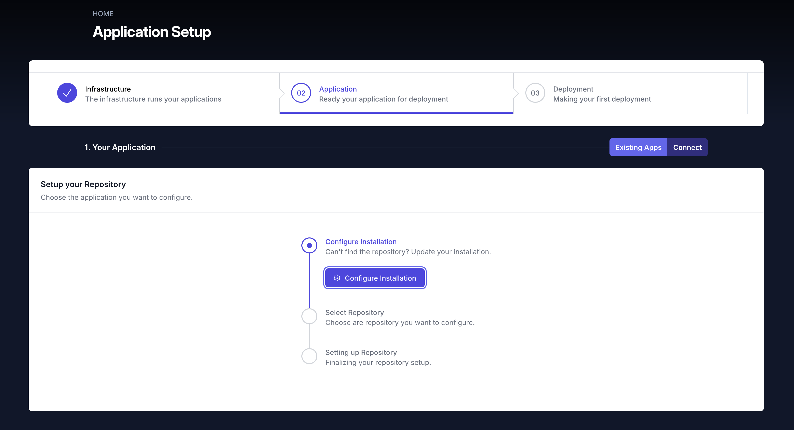
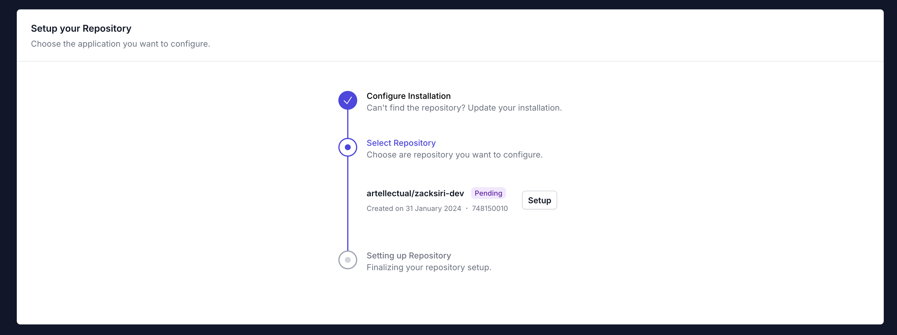

If you don't have any apps connected you'll see the `Configure Installation` button. Click on it and you should be given the option to choose which organziation and repositories you want to connect to OpsMaru.

## Setup Repository

Once you add the repositories you should be redirected back to OpsMaru and see a list of repositories.

Once you click `Setup` on the repository you can begin configuring your application. Each framework / language can be configured differently choose the one you want to deploy.

