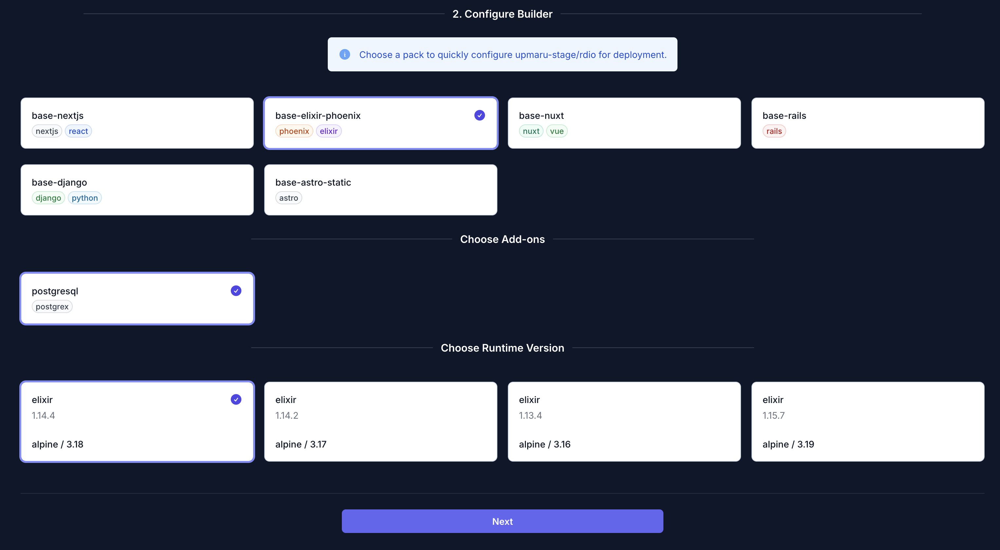
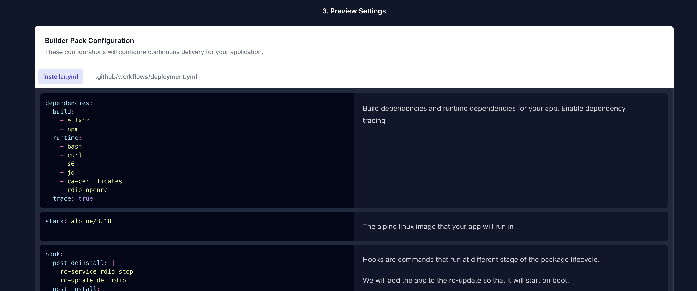

Once you have provisioned your infrastructure by running it using terraform, the next step is getting your application deployed. This guide will show you how to configure your phoenix app for deployment.

:::note[Connect your repo]
Make sure you have [connected your repository](/docs/application/connect-repository/) to OpsMaru. You should see your app in the `Existing Apps` tab.
:::

Click on `Configure` on the target app you want to deploy.


## Elixir / Phoenix Build Pack

Elixir and Phoenix have similar build commands so they share the same build pack.



In this guide we're choosing the following:

+ base-elixir-phoenix
  + postgresql

If you don't see the add-on or pack you want to use, please [reach out](https://github.com/orgs/upmaru/discussions). We will work towards getting the add-on you want into our platform.

Choose the version of elixir you wish to use. We currently support 4 versions. Please make sure you've tested and made sure your application is compatible with the version you select.


## Configuration Generation

Once you click `Next` you'll be able to see a preview and breakdown of the configuration that will be delivered to your application.



This configuration is meant as a starting point for your application. You can configure this further once it's submitted to your repository as a pull-request. 

You'll notice that the build command looks like the following:

```bash
export MIX_ENV=prod

mix local.hex --force
mix local.rebar --force
mix do deps.get --only prod

# npm --prefix ./assets install ./assets

# Comment out mix assets.deploy for non phoenix apps
mix assets.deploy

mix release
```

The build command for elixir projects and phoenix is actually the same `mix release`. The only difference is with phoenix you need to compile the assets. If you are not using phoenix simply comment out the un-necessary lines.

Once you're happy merge your pull-request and the build process should begin.