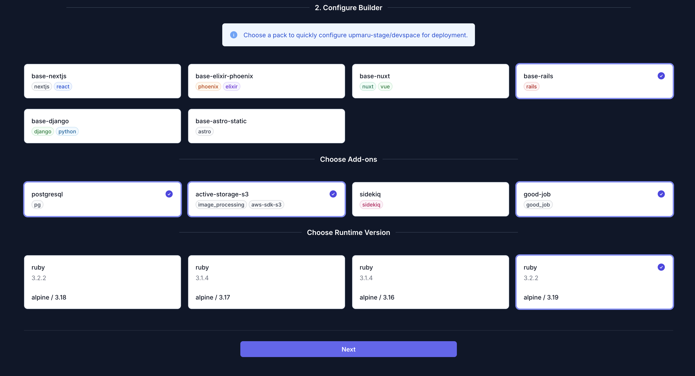
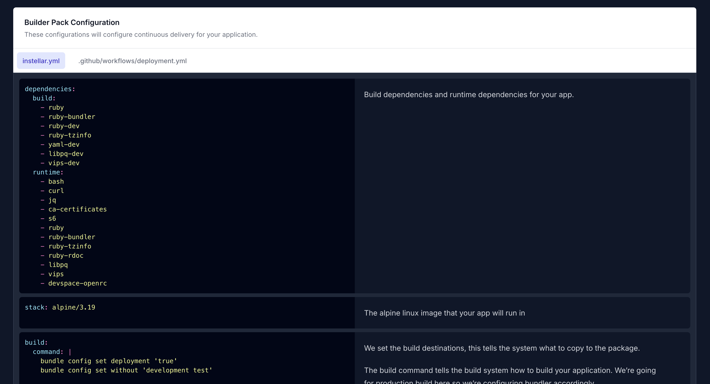

Once you have provisioned your infrastructure by running it using terraform, the next step is getting your application deployed. This guide will show you how to configure your rails app for deployment.

:::note[Connect your repo]
Make sure you have [connected your repository](/docs/application/connect-repository/) to OpsMaru. You should see your app in the `Existing Apps` tab.
:::

Click on `Configure` on the target app you want to deploy.

## Rails Build Pack

For your Rails app select the `base-rails` pack. This sets up all the system dependencies and then choose your add-ons.

In this guide we're choosing the following:

+ base-rails
  + postgresql
  + active-storage-s3
  + good-job

If you don't see the add-on or pack you want to use, please [reach out](https://github.com/orgs/upmaru/discussions). We will work towards getting the add-on you want into our platform.

:::note[Alpine 3.18 / 3.19]
You may note that Alpine 3.18 and 3.19 has the same version of ruby which is 3.2.2, in 3.19 ruby is built with support for yjit. If you've tested and your application works with yjit choose alpine 3.19.
:::

## Configuration Generation

Once you click `Next` you'll be able to see a preview and breakdown of the configuration that will be delivered to your application.

This configuration is meant as a starting point for your application. You can configure this further once it's submitted to your repository as a pull-request.

