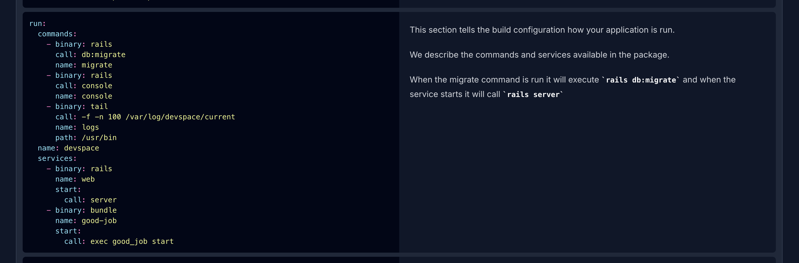

There is something to note about the generated configuration. If you scroll to the `run` section of your configuration, you will see a list of `commands`. These are commands you can run.



:::note[LXD Remote]
This guide assumes you've already [added your cluster](/docs/infrastructure/accessing-your-cluster/#lxc-remote) as a remote on your local machine.
:::

## Jumping into the Container

Applications are provisioned inside LXD containers. You can jump into the container in the following way:

```bash
lxc exec container-name --project project.name -- ash
```

This will take you inside your container.

## Migrations

If you use frameworks like Ruby on Rails or Phoenix you may have to work with migrations. They can be run in the following way.

```bash
rc-service app-name migrate
```

## Logs

You can view the logs of your application by using the command

```bash
rc-service app-name logs
```

## Console

If your application has console access you can use the following command.

```bash
rc-service app-name console
```

## Running Commands

If you wish to execute commands you can do so using the following:

```bash
lxc exec container-name --project project.name -- rc-service app-name [command]
```