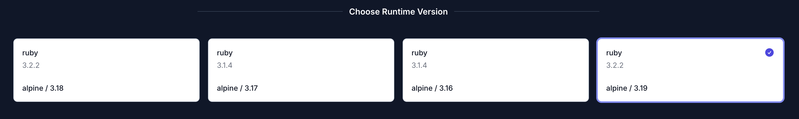

PAKman is a build system for building packages for your application. It's a simple way to build packages for your application and deploy them to your infrastructure.

We recommend using the build pack selection from the UI to generate the bulk of the configuration, but having an understanding of the generated file is also important.

:::note[PAKman is Open Sourced]
PAKman is open sourced and available on [GitHub](https://github.com/upmaru/pakman). Feel free to let us know if you have any feedback or suggestions.

There is also a [blog post](https://zacksiri.dev/posts/why-i-created-pakman) by the author (who also happens to be one of the founders of OpsMaru) about how all this works.
:::

## Configuring your build

PAKman uses the `instellar.yml` config in your application to generate the build instructions for `apk-tools`, which is the native package builder for Alpine Linux.

The basic structure of `instellar.yml` is as follows:

### Dependencies

The `dependencies` section describes all the `build` time and `runtime` dependencies your application requires. The example below is from a Rails app.

```yaml title="instellar.yml"
dependencies:
  build:
    - ruby
    - ruby-bundler
    - ruby-dev
    - ruby-tzinfo
    - libpq-dev
    - yaml-dev
    - vips-dev
  runtime:
    - bash
    - curl
    - jq
    - ca-certificates
    - s6
    - ruby
    - ruby-bundler
    - ruby-tzinfo
    - ruby-rdoc
    - libpq
    - vips
    - devspace-openrc
```

### Stack

The stack is where you choose which version of alpine you use. Stacks are similar to Heroku's stack. The only difference is Heroku's stack is based on ubuntu. 

```yaml title="instellar.yml"
stack: alpine/3.18
```

Each stack has a different version of dependencies. You can choose which stack to use depending on which version of your dependency you wish to use.



### Build

The build section essentially describes how to build your application. This will be different for each framework / language. The example below is from a Rails app.

```yaml title="instellar.yml"
build:
  command: |
    bundle config set deployment 'true'
    bundle config set without 'development test'
    
    bundle install
    
    bundle exec rails assets:precompile
  destinations:
    - '*'
    - .bundle
```

#### Destinations

The destinations directive tells the build system that the files in the destination should be included in the package. The `*` is a wildcard that includes all files in the root of the application. The `.bundle` is a directory that is included in the package.

### Hook

Hooks are commands that are run at different stages of the installation process. There are 4 main stages in the lifecycle.

+ post-install - These commands run after the package is installed. In the example below, we add the app `devspace` to the default application to run when the OS starts. That way if we restart the container the application automatically starts. We also run `rc-service devspace migrate`. This basically runs database migration.

+ pre-upgrade - These commands run before upgrade. In this case we stop the application before the upgrade.

+ post-upgrade - These commands run after the package is upgraded. In this case we want to run migrations and then start the new, upgraded version of the app.

+ post-deinstall - These commands run after the package is removed. Generally it is not used since we just delete the container and provision a new one if something goes wrong.


```yaml title="instellar.yml"
hook:
  post-deinstall: |
    rc-service devspace stop
    rc-update del devspace
  post-install: |
    rc-update add devspace
    rc-service devspace migrate
  post-upgrade: |
    rc-service devspace migrate
    rc-service devspace start
  pre-upgrade: |
    rc-service devspace stop
```

### Run

The `run` section describes how the application runs. It provides commands that tell the system how to run the application. In the example below, you will see the `commands` section and the `services` section.

+ services - These are commands that start the service of your application. In the example below we're starting a rails application by calling the `rails` binary followed with the `server` which essentially becomes `rails server`. In this case we also have a background worker called `good-job`. The below configuration essentially runs `bundle exec good_job start`

+ commands - These are commands that run one time and are not long lived processes. For example you can access the rails console by running `rc-service devspace console` or access the logs by using `rc-service devspace logs`.

Doing things this way enables us to `normalize` the experience. No matter what language or framework you use, you can use `rc-service [app-name] [command]` to run the commands you need.

:::tip[Useful Commands]
We have a section on how to run / call these commands. Check out the [useful commands page](/docs/application/useful-commands/)
:::

```yaml title="instellar.yml"
run:
  commands:
    - binary: rails
      call: db:migrate
      name: migrate
    - binary: rails
      call: console
      name: console
    - binary: tail
      call: -f -n 100 /var/log/devspace/current
      name: logs
      path: /usr/bin
  name: devspace
  services:
    - binary: rails
      name: web
      start:
        call: server
    - binary: bundle
      name: good-job
      start:
        call: exec good_job start
```

### Kits

Kits are something specific to `instellar`, our core engine that orchestrates deployments. Kits provide a way to configure things specific to your application. Kits answer the following questions:

+ Which port of my service to expose?
+ What are the environment variables my app depends on?
+ Which environment variables are automatically provisioned?
+ Which environment variables should be exposed to the application?
+ Which environment variables are required / options?
+ What are the application specific configurations required for resources?

In the example below we have a `web` kit, which is the main kit. We also have a `fork` which is the `good-job` process.

```yaml title="instellar.yml"
kits:
  - description: web service
    forks:
      - description: GoodJob worker
        name: good-job
        variables:
          - default_value: good-job
            key: SERVICE_MODE
    main: true
    name: web
    ports:
      - main: true
        name: web
        target: 3000
    variables:
      - default_value: production
        key: RAILS_ENV
      - default_value: '1'
        key: RAILS_SERVE_STATIC_FILES
      - driver: generic/secret
        driver_options:
          length: 128
        key: SECRET_KEY_BASE
      - driver: database/postgresql
        key: DATABASE
      - driver: bucket/aws-s3
        driver_options:
          cors: |
            [
              {
                "AllowedHeaders": [
                  "Content-Type",
                  "Content-MD5",
                  "Content-Disposition"
                ],
                "AllowedMethods": [
                  "PUT"
                ],
                "AllowedOrigins": [
                  {{- installation.origins -}}
                ],
                "MaxAgeSeconds": 3600
              }
            ]
        key: AWS_S3
```

You can see how kits are exposed in the UI when creating a new installation.


