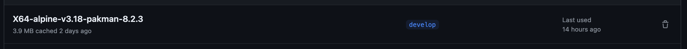
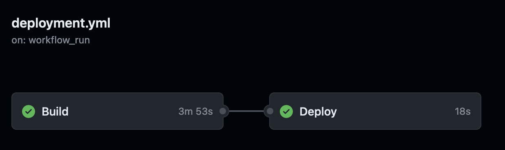

If you are still using v7 of PAKman, we recommend you upgrade to v8. Here are some benefits provided by v8

## New Features

Here are some benefits of upgrading to v8.

### Improved Build Times

v8 has improved build times by 25%. We utilize caching that can help reduce some repeated steps. PAKman v8 is also much slimmer than v7



### Better Resumability 

In v7 the build / deploy happens in a single step. Which means if the deploy fails for whatever reason the app also has to be rebuilt. In v8 we split the build into 2 steps which means if the deploy step fails, we can resume and use the built artifact.



### Improved Configuration

With v7 we had to build a release for every version of alpine. This is because in v7 we had to use docker ad the underlying container for running alpine. In v8 we switched to the `setup-alpine` action which means users can choose which version of alpine to use by setting the `with` option.

```yaml
- name: Setup Pakman
  uses: upmaru/pakman@v8
  with:
    alpine: v3.19
```

This also means we need to build 1 release of PAKman. Which is a quality of life improvement for the maintainers of PAKman

## Deprecating of v7

We are now deprecating v7. While v7 will continue to work, we will no longer be patching / updating v7. Any new features / support will only be on v8 moving forward.

