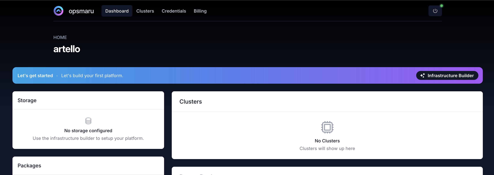
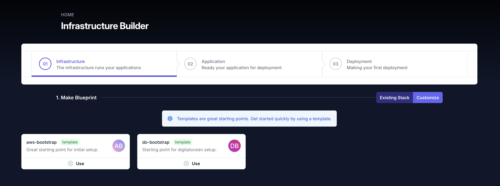
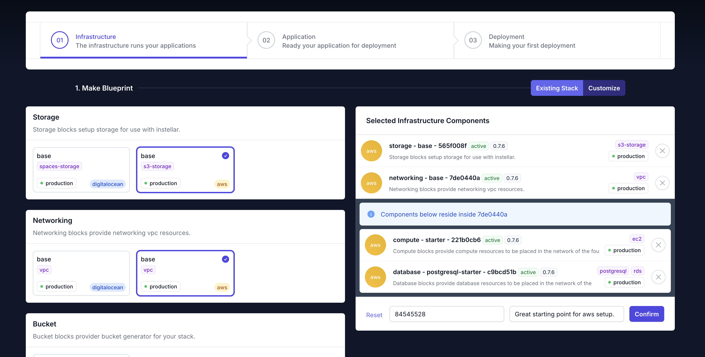
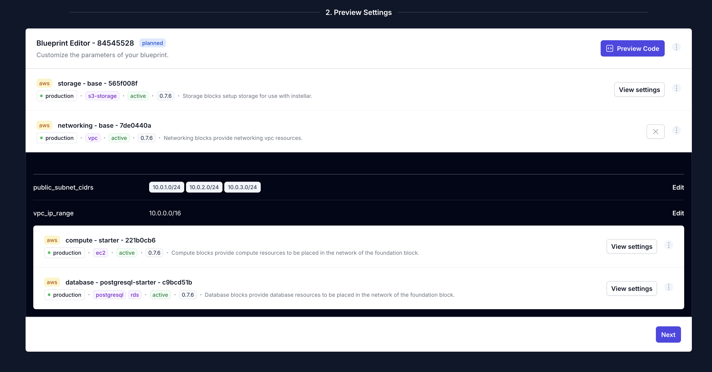
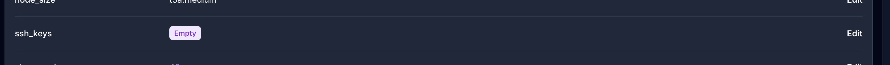
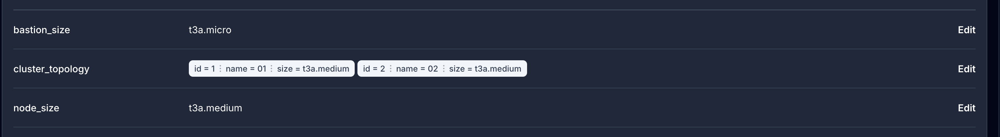

OpsMaru is a deployment platform creator. It helps developers setup platforms and also configures your applications for continuous deployment.

:::tip[Sign up for free!]
To get started first thing you'll need to do is [sign up](/auth/users/register) for an account.
:::

You'll be taken through the process and asked to connect your github account.

## Initial Setup

Once you've reached the dashboard of your organization click the `Infrastructure Builder`.

There are a few basic concepts to understand when using OpsMaru. You need a target platform to deploy to. This can be any cloud provider you choose. Currently we support 2, we'll be adding more to this list soon.

+ AWS
+ DigitalOcean

You can choose to bootstrap your account by selecting one of the templates in the Infrastructure Builder

Click `Use` on one of the templates.

This will stage your first platform with all the components necessary to get you started.

+ Storage - this will configure storage for OpsMaru.
+ Network - this will setup your network that will host the other components.
  + Compute - this will setup a cluster that will run your apps.
  + Database - this will create the database instance that your apps can use.

You can remove the database if you are running a front-end only app.

Once you're happy with your selection hit `Confirm` and hit `Next`. Remember you can always come back to change the configuration later.

## Configure your platform

In the preview step you have the ability to tweak and finetune your platform configuration. By clicking `View Settings` on each layer, you'll see the finegrained control.

### SSH Keys

:::note[Importing your ssh key]
Make sure you import your ssh key into your cloud provider's dashboard before adding them here. The configuration will refererence the value in the dashboard.

+ [AWS](/docs/infrastructure/aws/ssh-keys)
+ [Digital Ocean](/docs/infrastructure/digitalocean/ssh-keys)

:::

If you wish to access your cluster via ssh you'll need to be sure to add your ssh key name to the compute block.

### Cluster Topology

:::note[Bastion node]
Bastion nodes are there to enable secure connectivity. They're a security feature of your cluster, they cannot be removed. We're using the cheapest node so they don't add much to the cost.

If you would like to learn more about bastion nodes [click here](https://en.wikipedia.org/wiki/Bastion_host)
:::

The default configuration will setup a 3 node cluster + 1 bastion. You can change the instance type based on your requirement. More power more ram more expensive. You can edit the `cluster_topology` and remove the default nodes and come back to add them later when you need more scaling.

