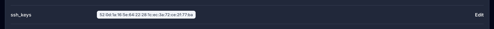

OpsMaru will provision your infrastructure with a bastion node and a LXD cluster. You have a few options when connecting to your cluster.

## SSH to the bastion node

If you want to ssh into your bastion, you need to make sure that in your configuration you've set the proper `ssh_keys` property.



If you've added `ssh_keys` to the compute block, you will be able to connect using ssh

import { Tabs, TabItem } from '@astrojs/starlight/components';

<Tabs>
  <TabItem label="AWS">
  ```bash title='aws'
  ssh ubuntu@your-bastion-public-ip
  ```
  </TabItem>

  <TabItem label="DigitalOcean">
  ```bash title='digitalocean'
  ssh root@your-bastion-public-ip
  ```
  </TabItem>
</Tabs>

### Jumping to the internal node

Your bastion doesn't run your application all it does is give you access to the internal cluster that's running your apps. You will need to jump to your internal node from your bastion using the private ip.

<Tabs>
  <TabItem label="AWS">
  ```bash title='aws'
  ssh ubuntu@node-private-ip
  ```
  </TabItem>

  <TabItem label="DigitalOcean">
  ```bash title='digitalocean'
  ssh root@node-private-ip
  ```
  </TabItem>
</Tabs>

## LXC Console

Once you're in your internal node you can query your cluster and run commands using the `lxc` tool. Try running:

```bash
lxc list --all-projects
```

You will see a list of containers running inside your cluster. Each of the containers run your application.

## LXC Remote

Jumping into your internal node can be quite cumbersome, most of the time you just need access to your LXD cluster and would prefer to use the `lxc` command. You can install `lxc` client locally on your mac using 

<Tabs>
  <TabItem label="MacOS">
  ```bash
  brew install lxc
  ```
  </TabItem>

  <TabItem label="Windows">
  ```bash
  choco install lxc
  ```
  </TabItem>

  <TabItem label="Ubuntu">
  ```bash
  sudo snap install lxd
  ```
  </TabItem>

  <TabItem label="Arch Linux">
  ```bash
  pacman -S lxd
  ```
  </TabItem>
  
  <TabItem label="Fedora">
  ```bash
  dnf copr enable ganto/lxc4
  dnf install lxd
  ```
  </TabItem>
</Tabs>

You can add your cluster as a remote on your local computer. 

### Trust Token

You will need to trust the certificate that's generated by LXD on your node. Make sure you are running this on your `bootstrap-node` and not bastion node.

```bash
lxc config trust add --name your-name
```

LXD will genrate a one time use trust token that you can use on your local machine.

Now from your local machine run

```bash
lxc remote add cluster-name bootstrap-node-public-ip
```

It will ask you to confirm the fingerprint and ask you for the `trust token`. Copy and paste the `trust token` in to the prompt.

Now when you run `lxc remote list` you should see the cluster.

### Switching remotes

You can switch to managing your cluster by running `lxc remote switch name-of-your-cluster`. To test that everything is working run 

```bash
lxc list --all-projects
```


