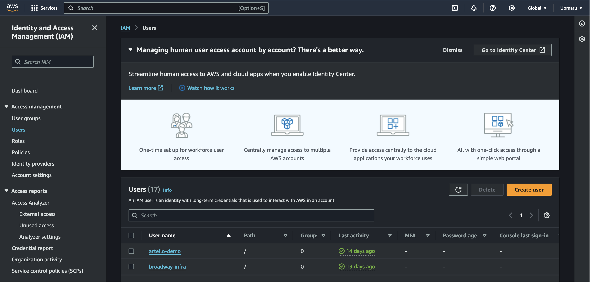
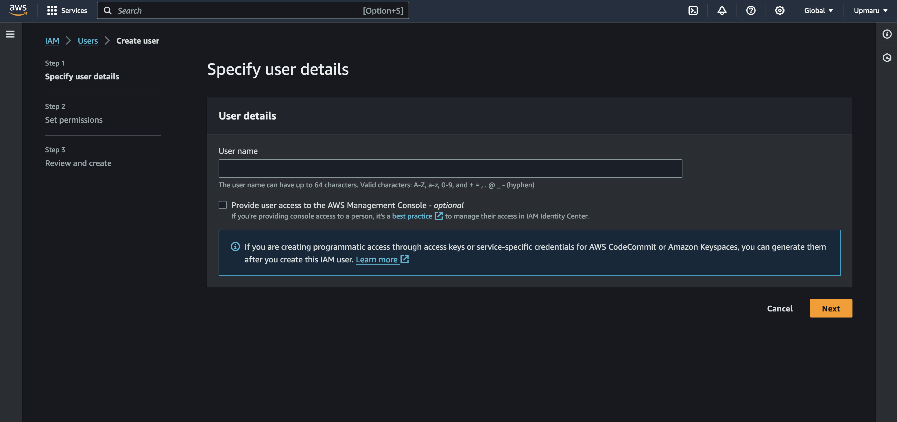
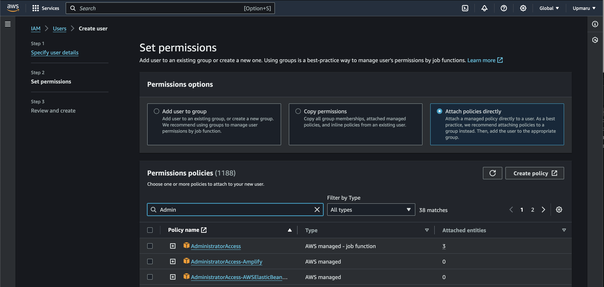
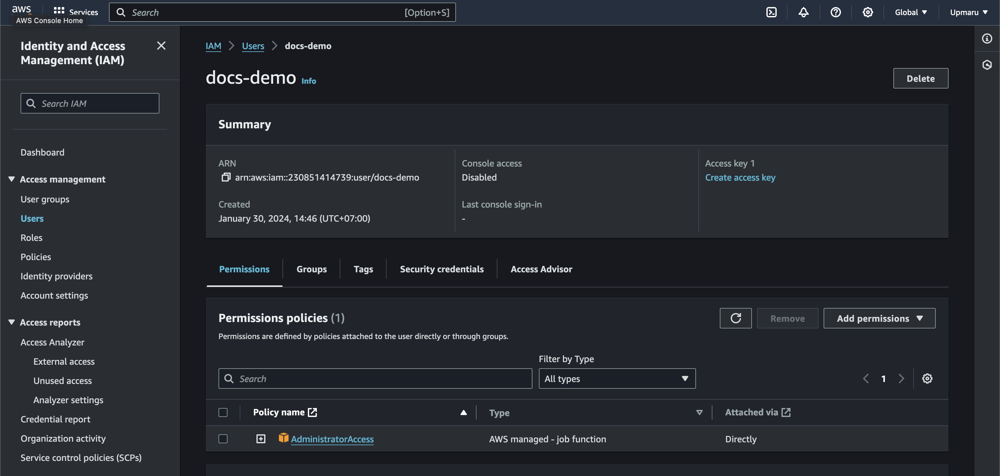
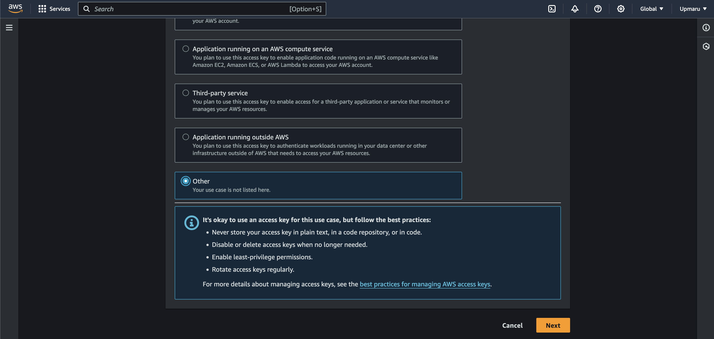
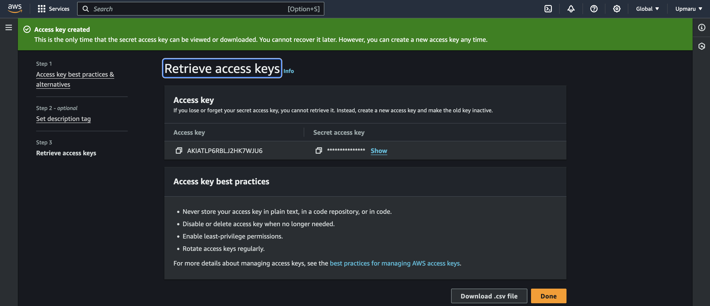

To provision your aws resources you'll need to generate some credentials to put into your terraform configuration.

Head over to the `IAM` dashboard in AWS. Click on the `Users` link on the sidebar.

## Create User

Click on the `Create user` button. 

This will bring you to a form, type in a `User name`, and proceed to the next screen.

### Attach Policy

Click on the `Attach policies directly` option. Then search for `Admin` then select the `AdministratorAccess` and scroll down at hit `Next`.

## Create Credential

Next browse to the page of the user you just created. Click on the `Create access key`.

You'll be ask to choose your use case, for our case choose `Other`.

Give your access key a description and click `Create access key`.

You'll be presented with your `Access key ID` and `Secret access key`. Copy these values and store them somewhere safe.

:::caution[Credential management]
Do not share these credentials to anyone, please store it safely:

+ Do not check them into source control.
+ If you use terraform cloud user variable sets to store them and check the `sensitive` option.
:::

### Further Detail

We have a video showing you how to store your credentials inside terraform cloud.

<iframe src="https://www.loom.com/embed/079bdd740b65437f88b3331edbfb4b6f?sid=78c0e5b5-2e86-421a-916e-75ed8defa4ba" frameborder="0" webkitallowfullscreen mozallowfullscreen allowfullscreen style="position: absolute; top: 0; left: 0; width: 100%; height: 100%;"></iframe>

