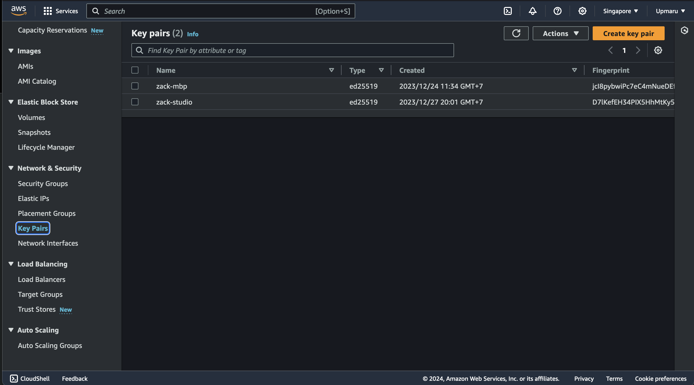
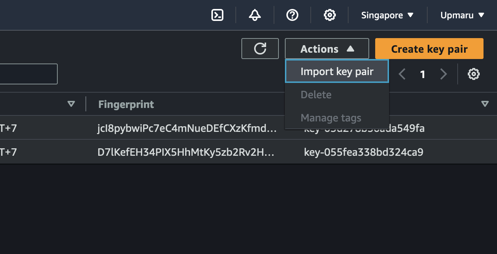
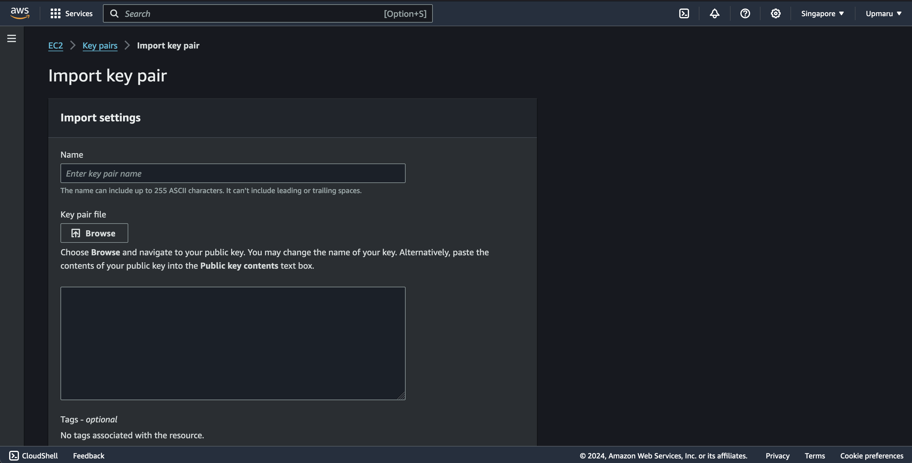

This guide shows you how to import your ssh key into your aws account.

Let's begin by browsing to the EC2 screen of your AWS console. Once on the EC2 dashboard look on the sidebar you'll see the `Key Pairs` section.



## Import Key Pair

Click on the `Actions` and select `Import key pair`.



You'll see an `Import key pair` form.



Type in the name of the key pair and copy the contents of your public ssh key into the `Public key contents` field. 

## Public key content

You can get the public key content from your terminal by running

```bash
cat ~/.ssh/id_rsa.pub
```

If you are using ed25519 keys, you can run

```bash
cat ~/.ssh/id_ed25519.pub
```

This assumes you are using the default location for your ssh keys. If you are using a different location, you'll need to update the path to your public key.


