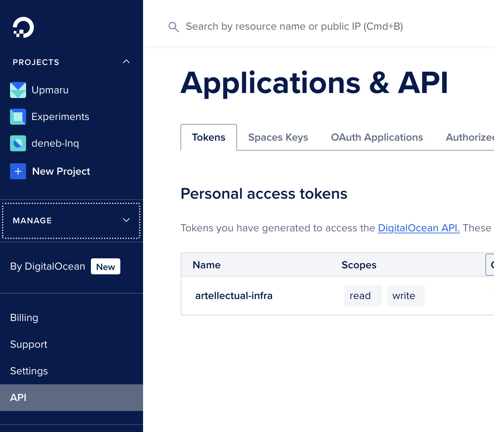
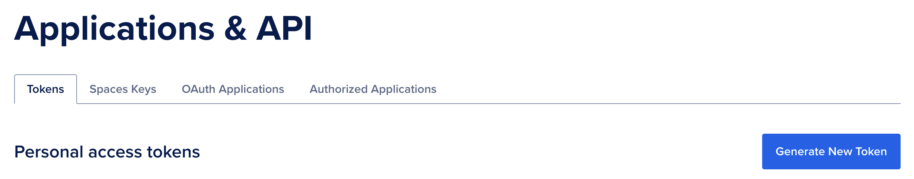
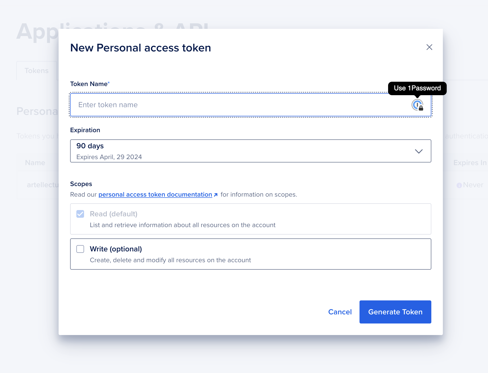
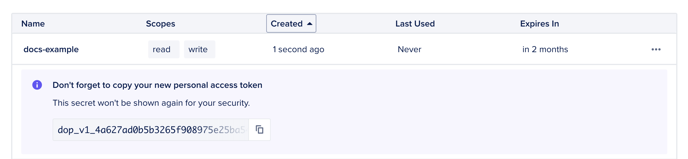
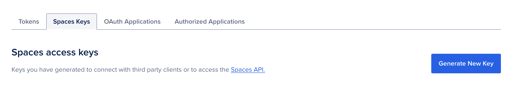
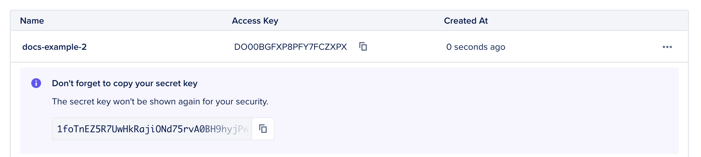

To provision resources with DigitalOcean you will need 2 types of credentials.

+ Spaces Token - used for setting up spaces buckets
+ API Token - used for setting up compute, databases and networking

## API Token

To get the `api token` head over to the API section on the side bar.

Click on the `Generate New Token` button.

Give your token a name you can identify it with. Be sure to check the `Write` permission and click `Generate Token`. You can choose an expiration, but you need to make sure to replace the token once it expires.

Once you create the token you will see it only once. Copy it and store it somewhere safe.

## Spaces Token

To get the `spaces token`, click on the `Spaces Keys` tab.

Click on the `Generate new key` button, give the key a name and click `Create access key`.

## Credential Management

In the Terraform configuration generated by our platform, the API token is referenced as `do_token`. 

The spaces access key is referenced as `do_access_key` and `do_secret_key`.

:::caution[Credential management]
Do not share these credentials with anyone, please store them safely.

+ Do not check them into source control.
+ If you use Terraform Cloud, use variable sets to store them and check the `sensitive` option.
:::

### Further Details

We have a video showing you how to store your credentials inside Terraform Cloud.

<iframe src="https://www.loom.com/embed/079bdd740b65437f88b3331edbfb4b6f?sid=78c0e5b5-2e86-421a-916e-75ed8defa4ba" frameborder="0" webkitallowfullscreen mozallowfullscreen allowfullscreen style="position: absolute; top: 0; left: 0; width: 100%; height: 100%;"></iframe>

