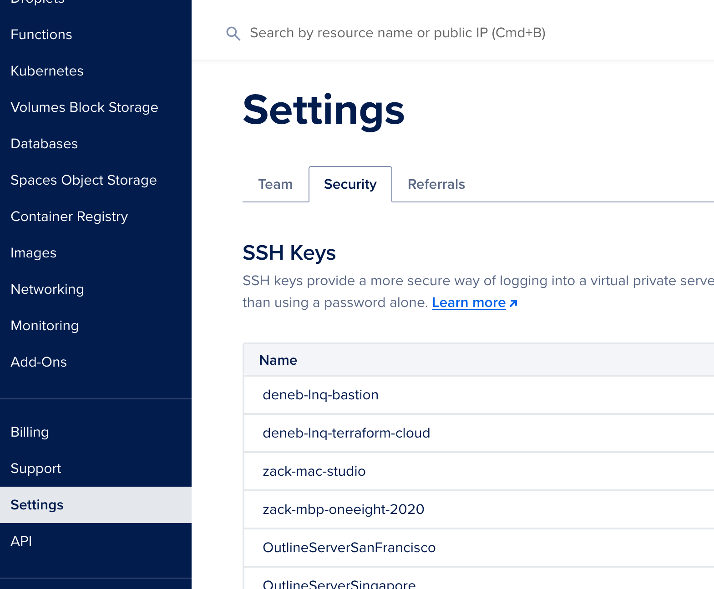
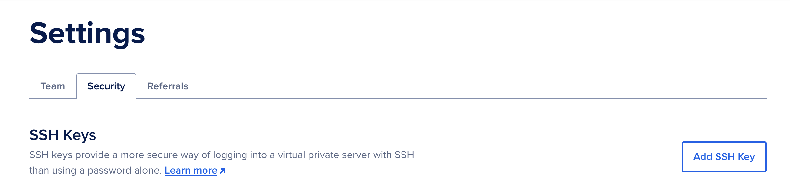
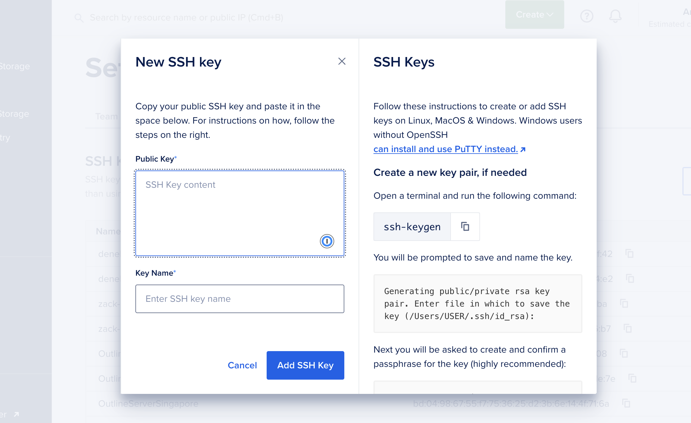

This guide shows you how to import your ssh key into your digitalocean account.

Let's begin by browsing to the `Settings` page of your digitalocean console. Once on the settings page look on the sidebar you'll see the `Security` section.



Click on the `Add SSH key` button.



## Create SSH Key

You'll see an `Add SSH key` form. Copy the ssh key from your terminal into the `Public Key` field.



You can get the public key content from your terminal by running

```bash
cat ~/.ssh/id_rsa.pub
```

If you are using ed25519 keys, you can run

```bash
cat ~/.ssh/id_ed25519.pub
```

Give the key a name and click `Add SSH key`.


