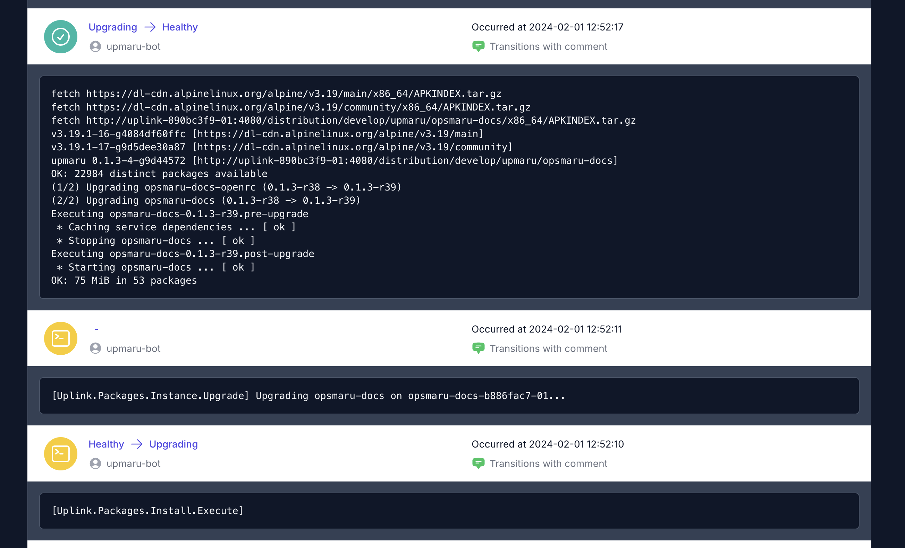

Uplink is a tool that operates your cluster and application. When you bootstrap your platform using the `Infrastructure Builder` uplink is the first container that runs. It provides functinality that keeps your cluster running smoothly and automates away most of the complexities in deploying and upgrading your application.

:::note[Uplink is Open Sourced]
Uplink is open sourced and available on [GitHub](https://github.com/upmaru/uplink). Feel free to let us know if you have any suggestions.

There is also a [blog post](https://zacksiri.dev/posts/self-provisioning-ecto-based-application) about some of the parts of uplink work.
:::

Below are some of the features that uplink provide.

## Managing Caddy

Inside the uplink container there are 2 main processes.

+ `uplink` - This is the uplink app.
+ `uplink-caddy` - This is a [specially built](https://github.com/upmaru/uplink-caddy) version of caddy that serves your application.

It's responsible for managing SSL certificates and serving your application. Uplink communicates with OpsMaru and ensures all the configuration for caddy are automatically updated when something changes.

## Hosting Packages

We've mentioned before that your application / source code never touches our platform. This means everything is served from within your cluster. When a deployment happens Uplink will automatically download the built archive of your application and set it up and trigger an upgrade on the running containers. When application containers are bootstrapped or upgrade you can see evidence of this in the logs.

Here is an example 

```shell
fetch https://dl-cdn.alpinelinux.org/alpine/v3.19/main/x86_64/APKINDEX.tar.gz
fetch https://dl-cdn.alpinelinux.org/alpine/v3.19/community/x86_64/APKINDEX.tar.gz
fetch http://uplink-890bc3f9-01:4080/distribution/develop/upmaru/opsmaru-docs/x86_64/APKINDEX.tar.gz
v3.19.1-16-g4084df60ffc [https://dl-cdn.alpinelinux.org/alpine/v3.19/main]
v3.19.1-18-gdafb13ff2a9 [https://dl-cdn.alpinelinux.org/alpine/v3.19/community]
# Uplink is hosting your package
upmaru 0.1.3-7-gc9b0f60 [http://uplink-890bc3f9-01:4080/distribution/develop/upmaru/opsmaru-docs]
OK: 22984 distinct packages available
(1/2) Upgrading opsmaru-docs-openrc (0.1.3-r40 -> 0.1.3-r41)
(2/2) Upgrading opsmaru-docs (0.1.3-r40 -> 0.1.3-r41)
Executing opsmaru-docs-0.1.3-r41.pre-upgrade
 * Caching service dependencies ... [ ok ]
 * Stopping opsmaru-docs ... [ ok ]
Executing opsmaru-docs-0.1.3-r41.post-upgrade
 * Starting opsmaru-docs ... [ ok ]
OK: 76 MiB in 53 packages
```

In the example log above notice that the package is being hosted in the uplink instance that's running inside your cluster `http://uplink-890bc3f9-01:4080/distribution/develop/upmaru/opsmaru-docs`

## Application Lifecycle

Uplink also orchestrates and manages the lifecycle of your application. It's responsible for deploying your application, upgrading it, scaling it, and ensuring it's always running.

If anything fails during an upgrade uplink will provision a new container running your application automatically.



## Service Discovery

Uplink provides endpoints that can be used to discover services running in your cluster. This means your application can poll the endpoint to figure out other services running in the cluster that may be relevant. For example [elixir / phoenix clustering](/docs/application/phoenix/clustering/) utilizes service discovery to connect to other nodes.


