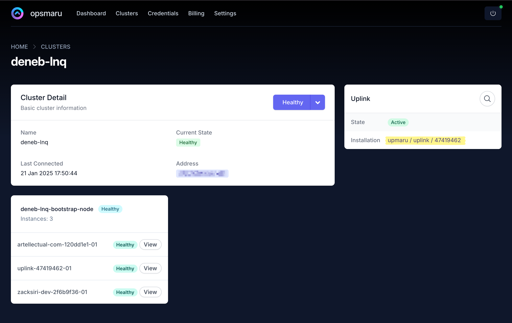

We [regularly push](https://github.com/upmaru/uplink/actions?query=branch%3Amaster+) upgrades to uplink, and for the most part upgrades are seamless. However there may be some cases where upgrades can have some downtime of about 30-60 seconds. Usually we will announce this on our [discord channel](https://discord.gg/VpBrfC86) to make sure our customers are aware.

If you would like to control when you receive upgraded to your cluster, you can switch to `manual` upgrade strategy following the instructions below:

## Uplink Installation

To change your uplink's upgrade strategy locate the uplink installation by heading over to the cluster page.

Choose the cluster you want to manage, once in the cluster detail click on the uplink page.

Once you are on the uplink installation page you will see the upgrade strategy. By default it will be set to `continuous` to continuously receive upgrades.

If you wish to upgrade uplink at your own convenience please change this setting to `manual`. Once you change to manual, you can use the `Sync` option on the Installation to trigger an upgrade.
