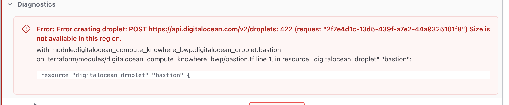

OpsMaru provisions cluster on cloud providers. These are environments we do not control. There are many components and potentially many things can go wrong during the process. While we do our best to ensure a smooth operation, there are things that are out of our control. 

These are a list of things that can possibly happen and how to fix them.

## API Errors

If you are seeing some kind of API error from the cloud provider, make sure that your credentials are correctly setup and working. Your errors may also be related to bad input values.

### Parameter Error

Sometimes we can input the wrong value. DigitalOcean, for example, does not support certain instance types in different regions. All you have to do to resolve such issues is to select a different instance type.

## Networking Errors

Your cluster may have been successfully provisioned, however sometimes there are networking issues that can prevent your installation from being deployed. OpsMaru clusters depend on internal networking communications, and in cases where there are internal networking issues, this can cause failure when booting up your application container.

You can resolve these issues easily by [sshing into](/docs/infrastructure/accessing-your-cluster/) your node and rebooting it.

